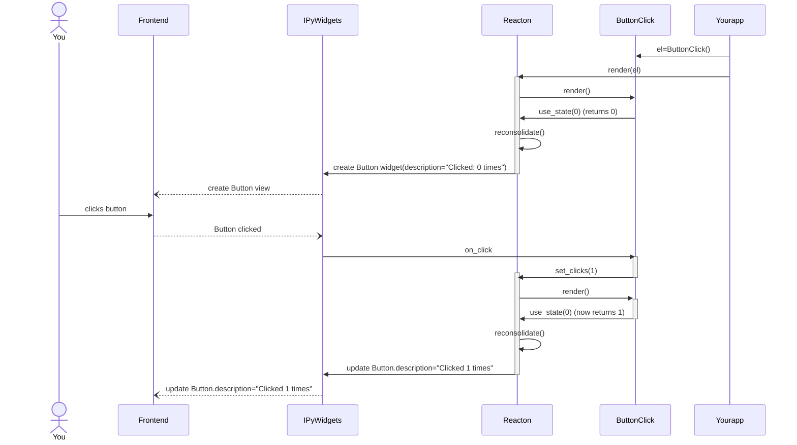

# Documentation

Write ipywidgets like Reacton. Create a Web-based UI from Python, using ipywidgets made easier, fun, and without bugs.

## What is Reacton

A way to write reusable components in a React-like way, to make Python-based UI's using the ipywidgets ecosystem (ipywidgets, ipyvolume, bqplot, threejs, leaflet, ipyvuetify, ...).

## Why? What is the problem?

Non-declarative UI's are complex: You have to attach and detach event handlers at the right point, there are many possibles states your UI can be in, and moving from one state to the other can be very hard to do manually and is very error-prone.

Using Reacton, you write a component that gives a declarative description of the UI you want based on data. If the data changes, your component render function re-executes, and Reacton will find out how to go from the previous state to the new state. No more manual "diffing" on the UI, no more manual tracking of which event handlers to attach and detach.

A common issue we also see is that there is one piece of code to set up the UI, and scattered around in many event handlers the changes that are almost repetitions of the initialization code.

## Why use a React-like solution

Using a declarative way, in a React (JS) style, makes your codebase smaller, less error-prone, and easier to reason about. We don't see a good reason *not* to use it.

Also, React has proven itself, and by adopting a proven technology, we can stand on the shoulders of giants, make use of a lot of existing resources, and do not have to reinvent the wheel.

## What does Reacton do for me?

Instead of telling ipywidgets what to do, e.g.:

  * Responding to events.
  * Changing properties.
  * Attaching and detaching event handlers.
  * Adding and removing children.
  * Manage widget lifetimes (creating and destroying).

You tell Reacton what you want (which Widgets you want to have), and you let Reacton take care of the above.


## Installing

```bash
$ pip install Reacton
```


## Getting started

Put this in the Jupyter notebook:

```py
import reacton
import reacton.ipywidgets as w

@reacton.component
def ButtonClick():
    clicks, set_clicks = reacton.use_state(0)
    def my_click_handler():
        set_clicks(clicks+1)
    button = w.Button(description=f"Clicked {clicks} times",
                      on_click=my_click_handler)
    return button
```

Make the last expression of your cell:

```py
ButtonClick()
```

Or explicitly display it using:

```py
el = ButtonClick
display(el)
```


## Understanding

To help you better understand how Reacton works, we have create the following sequence diagram
that shows what happens when you create the `ButtonClick` element, let Reacton
render it, and then click on the button once.




In words

   1. We create an element `el = ButtonClick()`
   1. The `display(el)` triggers the call to Reacton' [render](#render).
   1. The render call enters the render phase, which will call the function body (which we call render function) of the `ButtonClick` component.
   1. Our ButtonClick render function calls [`reacton.use_state`](#use_state). Because this is our first render phase, this returns the initial value (0).
   1. The ButtonClick render function returns a Button element (not a widget!) with `description="Clicked: 0 times"`.
   1. The react render call is done with the render phase, and enter the reconciliation phase, where it looks at the difference between the real widgets and the virtual widgets tree (represented by the react elements). We find there is no previous widget associated with the virtual widget (or element) and decide to create a widget.
   1. Asynchronously via the Jupyer protocol, a widget model and view are being created, and displayed to the user in the browser.
   1. The user clicks on the button.
   1. The `on_click` handler gets triggered on the Python side, inside of the `ButtonClick` component (called `my_click_handler`).
   1. `my_click_handler` handler calls `set_clicks(1)` which triggers a re-render.
   1. The render call enters the render phase, which calls the render fuction of `ButtonClick` for the second time.
   1. Our ButtonClick render function calls [`reacton.use_state`](#use_state). Because this is our second render phase, this returns the last set value, which is 1.
   1. The ButtonClick render function returns a new Button element (not a widget!) with the description `"Clicked: 1 times"`.
   1. The react render call is done with the render phase, and enter the reconciliation phase, where it looks at the difference between the real widgets and the virtual widgets tree (represented by the react elements). We find there is a widget associated with the virtual widget (or element) and decide to update the changed attributes of the widget and set `description` to `"Clicked: 1 times"`.
   1. Asynchronously via the Jupyter protocol, the widet model and view are being updated in the browser.


## Examples

API documentation is great, but like writing, you learn by reading.

Our example notebooks can be found at:

   * [https://github.com/widgetti/Reacton/tree/master/notebooks](https://github.com/widgetti/Reacton/tree/master/notebooks)


Or try them out directly in a Jupyter environment (JupyterLite)

   * [](https://Reacton.readthedocs.io/en/latest/_output/lab/index.html)

Direct link to examples:

   * [ButtonClick](https://Reacton.readthedocs.io/en/latest/_output/lab/index.html?path=click-button.ipynb)
   * [Calculator](https://Reacton.readthedocs.io/en/latest/_output/lab/index.html?path=calculator.ipynb)
   * [Todo-app](https://Reacton.readthedocs.io/en/latest/_output/lab/index.html?path=todo-app.ipynb)


## API


### Core

#### component

```py
FuncT = TypeVar("FuncT", bound=Callable[..., Element])

@overload
def component(obj: FuncT) -> FuncT:
    ...
```

Decorator that turns a function into a Reacton component. Should return an element. Note that the type signature is formally incorrect (we do not return a FuncT but a reacton.core.ComponentFunction instance), but this
gives good type hints in editors and good type checker support.

Example
```py
@reacton.component
def ButtonClick():
    clicks, set_clicks = reacton.use_state(0)
    def my_click_handler():
        set_clicks(clicks+1)
    button = w.Button(description=f"Clicked {clicks} times",
                      on_click=my_click_handler)
    return button
```

Note that calling the component will not execute the function directly, but will return an `Element` (not the Button element!) that can be passed to [render](#render). All argument used on the call to the component are bound to the element such that they can be passed onto the render function when needed.

#### render


```py
def render(
    element: Element[T], container: None = None, children_trait="children", handle_error: bool = True
) -> Tuple[widgets.Widget, _RenderContext]:
    ...
```

Execute the first render pass of the element to turn it into a set of widets. If no container is provided, an `ipywidgets.VBox` is created and returned. The second
return value is a `_RenderContext` (which is currently considered a private API class).
The resulting top level widget (associated to element being passed in) will be set as the first child of the container.
Note that re-renders may change this first child (since a component can return a different element each render), hence the need for the container.

Subsequent renders will be triggered by internal calls to the setter of [use_state](#use_state) or calls to [provide_context](#provide_context).

If re-renders needs to be triggered due to an external data change, the following pattern is often used:

```py hl_lines="3 4 6 10"
@reacton.component
def SomeComponent():
    counter, set_counter = reacton.use_state(0)
    def force_update():
        # note the use of the lambda to avoid stale data
        set_counter(lambda counter: counter+1)

    def listen():
        def on_change():
            force_update()

        # listen to external data changes
        handle = external_service.subscribe(on_change)

        def cleanup():
            external_service.unsubscribe(handle)
        return cleanup

    use_effect(listen, [])  # will only subscribe and unsubscribe once

    # use external data
    value = external_service.value
    ...
```


### Hooks

It might be worth [reading the ReactJS documentation on Hooks](https://reactjs.org/docs/hooks-reference.html) as well:

Rules of hooks (see also [ReactJS](https://reactjs.org/docs/hooks-rules.html)):

   * Do not use hooks conditionally
   * Do not use hooks in a loop

Note that this is *per* component.
The reason behind this is that hooks return values depend on the order of the hooks, i.e.the 2nd hook call should always be the second hook call.

For every new component the 'hooks call counter' will be reset.

For instance, instead of creating an element and calling a hook in a loop, create a new component that uses that hook, and create the element for that component in a loop instead.

For instance, do not do this:

```py
@reacton.component
def Wrong(count:int = 0):
    with w.VBox():
        for i in range(count):
            el = SomeThing()
            use_effect(...)  # not a fixed amount of hooks calls!
```

Refactor it like this:

```py
@reacton.component
def Right(count:int = 0):
    with w.VBox():
        for i in range(count):
            SomeComponent()


@reacton.component
def SomeComponent(count:int = 0):
    el = SomeThing()
    use_effect(...)  # just 1 hook call per component
    return el

```

#### use_state

```py
def use_state(initial: T, key: str = None,
              eq: Callable[[Any, Any], bool] = None
              ) -> Tuple[T, Callable[[Union[T, Callable[[T], T]]], None]]:
    ...
```

Returns a `(value, setter)` tuple that is used to manage state in a component.

This function can only be called from a component function.

The value returns the current state (which equals `initial` at the first render call). Or the value that was last set using the setter.

Note that the setter function can be used in two ways.

Directly setting the value:

```py hl_lines="5"
@reacton.component
def ButtonClick():
    clicks, set_clicks = reacton.use_state(0)
    def my_click_handler():
        set_clicks(clicks+1)
    button = w.Button(description=f"Clicked {clicks} times",
                      on_click=my_click_handler)
    return button
```

Updating the value based on the previous/current value.

```py hl_lines="5"
@reacton.component
def ButtonClick():
    clicks, set_clicks = reacton.use_state(0)
    def my_click_handler():
        set_clicks(lambda prev: prev+1)
    button = w.Button(description=f"Clicked {clicks} times",
                      on_click=my_click_handler)
    return button
```

The last one avoid issues with stale data, which means you have a reference to the value of an old render pass (not present in this simple example).


#### use_effect

```python
EffectCleanupCallable = Callable[[], None]
EffectCallable = Callable[[], Optional[EffectCleanupCallable]]

def use_effect(effect: EffectCallable, dependencies=None):
    ...
```

Executes non-declarative code in a callback, for instance to cause side effects like attaching event handlers.

The `effect` callable will run after the component is turned into concrete widgets, which allows us to get a reference to the real underlying
widgets using [get_widget](#get_widget).

The return value of the callback can return a cleanup function which will be called when the component is removed, or before the effect
is invoked again (when using dependencies).

If no dependencies are given, the effect and its cleanup will be executed after each render.

Example usage:

```py
@reacton.component
def SomeComponent():
    def listen():
        handle = external_service.subscribe(...)

        def cleanup():
            external_service.unsubscribe(handle)
        return cleanup
    # will only subscribe and unsubscribe once
    use_effect(listen, [])
    # the following will
    #   * subscribe once at first render
    #   * unsubscribe/subcribe after each render
    #   * unsubscribe once when the component gets removed
    # use_effect(listen)
    ...
```

#### use_memo

```
def use_memo(f: Callable, dependencies=None, debug_name: str = None):
    ....
```

[Memoize](https://en.wikipedia.org/wiki/Memoization) the last function return based on its dependencies. The function will only be executed the first time, or when its dependencies changes.
If dependencies is `None` the dependencies are obtained automatically by inspecting the nonlocal variables. Pass an empty list (or any fixed value that supports comparison ) to only execute the function once for the lifetime of the component.

Example relying on the automatic detection of dependencies:
```py
@reacton.component
def Test(x):
    def square():
        # use_memo will automatically detect x as a dependency
        return x**2

    y = reacton.use_memo(square)
    return w.Label(value=f"{x} - {y}")
```


Sometimes, automatic detection on variables is not ideal when the dependencies are expensive to calculate, or do not even
support comparison. In that case, we can manually define dependencies.

```py
@reacton.component
def Test(count):
    x = np.arange(count)
    def cumulative_sum():
        # automatic detection would compare the numpy arrays
        # which could be slow
        return x.cumsum()

    # instead, we know that the underlying dependency is `count'
    y = reacton.use_memo(cumulative_sum, [count])
    return w.Label(value=f"{value} - {y}")
```


#### use_context

```py
def use_context(user_context: UserContext[T]) -> T:
    ...
```

Returns the current value for the context created with [create_context](#create_context). The current value is defined as the value provided by
the nearest ancestor who provided the value using [provide_context](#provide_context) or the default value of [create_context](#create_context).

Note that the type passed in [create_context](#create_context) defines the return type of `use_context` (meaning we have type safety).

```python
# typed with int
myvalue_context = reacton.create_context(1)
some_other_value_context = reacton.create_context(33)


@reacton.component
def RootComponent():
    myvalue_context.provide(42)
    # this is a different context, just to show you can have multiple
    # user contexts with the same type
    some_other_value_context.provide(333)
    return ChildComponent()


@reacton.component
def ChildComponent():
    return SubChildComponent()


@reacton.component
def SubChildComponent():
    return SubSubChildComponent()


@reacton.component
def SubSubChildComponent():
    # many layers between the root component and this component
    # but we are able to pass it down without having to do this via
    # argument. value should be 42 due to `RootComponent`
    value = reacton.use_context(myvalue_context)
    return w.IntSlider(value=value)
```


#### use_reducer

```py
T = TypeVar("T")
U = TypeVar("U")

def use_reducer(reduce: Callable[[T, U], T], initial_state: T) -> Tuple[T, Callable[[U], None]]:
    ...
```

See [The ReactJS documentation](https://reactjs.org/docs/hooks-reference.html#usereducer)

#### use_ref

```py
class Ref(Generic[T]):
    def __init__(self, initial_value: T):
        self.current = initial_value

def use_ref(initial_value: T) -> Ref[T]:
    def make_ref():
        return Ref(initial_value)

    ref = use_memo(make_ref, [])
    return ref
```

Returns a mutable proxy object that initially holds the initial value and can be mutated by anyone who has a reference to the proxy.

The implementation is so trivial, that the full source code is added here.

Note that assigning a new value will not trigger a rerender.


#### provide_context

```py
# this does not work well with mypy, UserContext[T] and obj:T
# so for type hints it is better to use user_context.provide
def provide_context(user_context: UserContext[T], obj: T):
    ...
```

Sets the value for the `user_context`. Any call to `use_context` after the call to `provide_context`, or in any child component will
return the `obj` value.

Note that because mypy does not give type warnings for `provide_context`, it may be more convenient to use `user_context.provide` (see [use_context](#use_context) for an example)

### Other
#### create_context

```py
def create_context(default_value: T, name: str = None) -> UserContext[T]:
    ...
```

Create a context object to be used with [use_context](#use_context) and [provide_context](#provide_context).
This is used to 'transport' objects down a component hierarchy, without having to pass it down the arguments
of each child component. This reduces the number of explicit dependencies/argument of your components.

See [use_context](#use_context) for usuage.

#### get_widget


```py
def get_widget(el: Element):
    ...
```


Returns the real underlying widget, can only be used in use_effect. Note that if the same element it used twice in a component, the widget corresponding to the last element will be returned.
