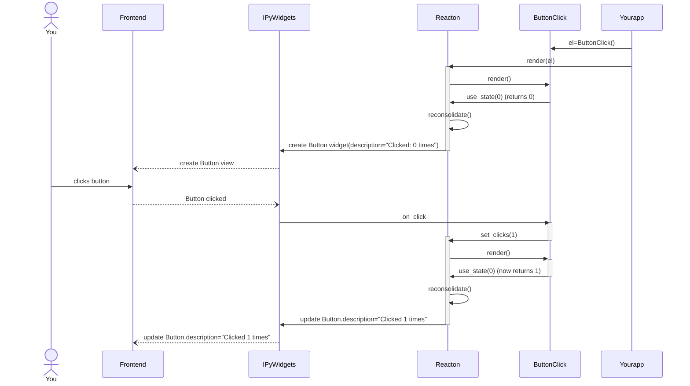

## Understanding

To help you better understand how Reacton works, we have create the following sequence diagram
that shows what happens when you create the `ButtonClick` element, let Reacton
render it, and then click on the button once.

In words

   1. We create an element `el = ButtonClick()`
   1. The `display(el)` triggers the call to Reacton' [render](#render).
   1. The render call enters the render phase, which will call the function body (which we call render function) of the `ButtonClick` component.
   1. Our ButtonClick render function calls [`reacton.use_state`](#use_state). Because this is our first render phase, this returns the initial value (0).
   1. The ButtonClick render function returns a Button element (not a widget!) with `description="Clicked: 0 times"`.
   1. The Reacton render call is done with the render phase, and enters the reconciliation phase, where it looks at the difference between the real widgets and the virtual widgets tree (represented by the Reacton elements). We find there is no previous widget associated with the virtual widget (or element) and decide to create a widget.
   1. Asynchronously via the Jupyter protocol, a widget model and view are created and displayed to the user in the browser.
   1. The user clicks on the button.
   1. The `on_click` handler gets triggered on the Python side, inside of the `ButtonClick` component (called `my_click_handler`).
   1. `my_click_handler` handler calls `set_clicks(1)` which triggers a re-render.
   1. The render call enters the render phase, which calls the render function of `ButtonClick` for the second time.
   1. Our ButtonClick render function calls [`reacton.use_state`](#use_state). Because this is our second render phase, this returns the last set value, which is 1.
   1. The ButtonClick render function returns a new Button element (not a widget!) with the description `"Clicked: 1 times"`.
   1. The Reacton render call is done with the render phase, and enters the reconciliation phase, where it looks at the difference between the real widgets and the virtual widgets tree (represented by the Reacton elements). We find there is a widget associated with the virtual widget (or element) and decide to update the changed attributes of the widget and set `description` to `"Clicked: 1 times"`.
   1. Asynchronously via the Jupyter protocol, the widet model and view are being updated in the browser.
